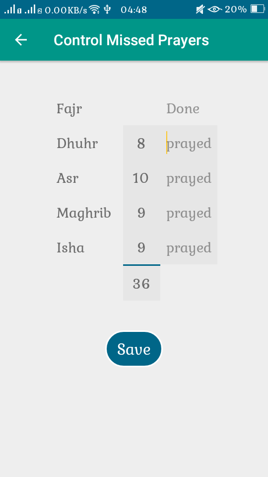
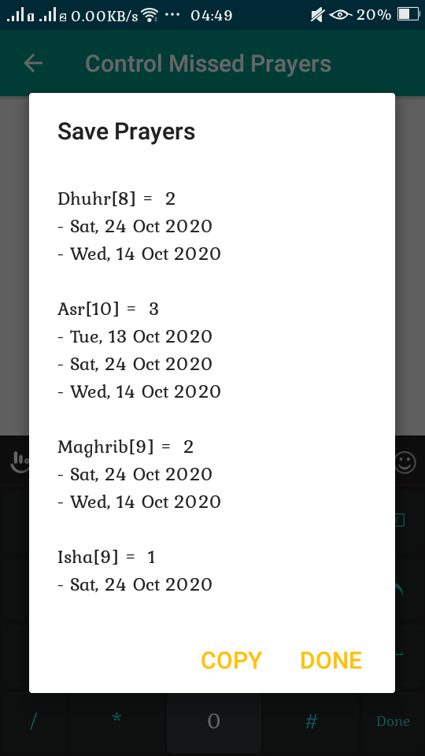

# qamardeen-android
Islamic Activity Tracker

## Control Missed Prayers

Simple statistical activity that fetch all missed prayers whose status `PrayerType.NOT_SET` And provide simple and abbreviated way to set their status to prayed (Qada2) `PrayerType.LATE`

| **Main Layout** | **Save** |
|-----------------|----------|
| |  |
